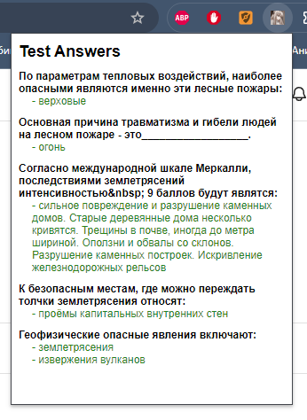
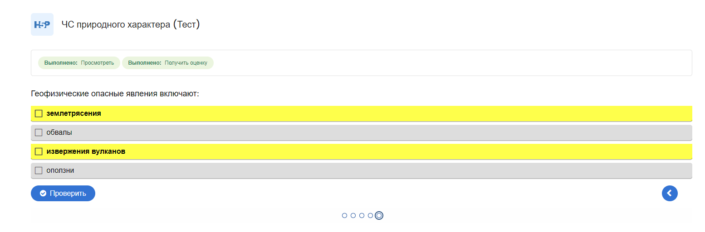

Вот пример README для вашего расширения для Chrome:

---

# Расширение для Chrome для извлечения правильных ответов из тестов EIOS и LMS

## Описание

Это расширение для Chrome позволяет автоматически извлекать правильные ответы из тестов, размещенных на сайте **eios.kantiana.ru** и **lms.kantiana.ru**. При заходе на страницу с тестом расширение будет получать URL h5p файла, извлекать из него данные и отображать правильные ответы для каждого вопроса.

## Функциональность

- **Автоматическое извлечение правильных ответов**: Расширение анализирует тесты на сайте и извлекает правильные ответы из JSON файла.
- **Обработка h5p файлов**: Расширение получает URL на h5p файл из payload страницы, анализирует его и извлекает данные из `content.json`.
- **Вывод правильных ответов**: Расширение записывает правильные ответы в меню расширения для каждого вопроса.
- **Выделение правильных ответов**: Расширение выделяет правильные ответы ярким цветом чтобы не тратить ваше время.

## Установка

### Локальная установка в Chrome

1. Перейдите на `chrome://extensions/`.
2. Включите **Режим разработчика**.
3. Нажмите на **"Загрузить распакованное расширение"**.
4. Выберите папку с вашим расширением.
5. Готово.
   1. Можете закрепить расширение для большего удобства
## Скриншоты

## Разработка

Если вы хотите внести изменения или дополнения:

1. Клонируйте репозиторий.
2. Установите все необходимые зависимости (если есть).
3. Внесите изменения в код.
4. Запакуйте расширение снова, если хотите протестировать изменения.
